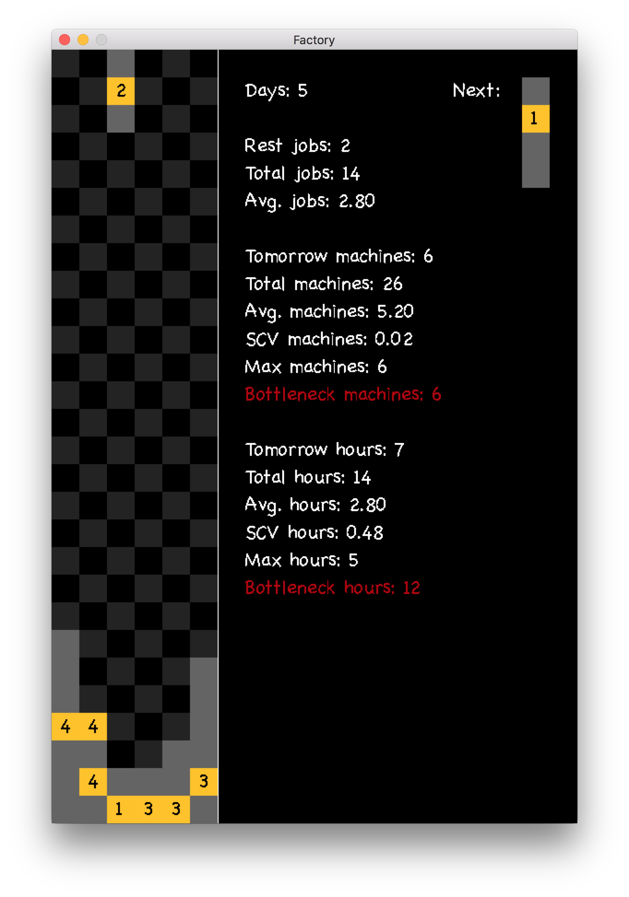
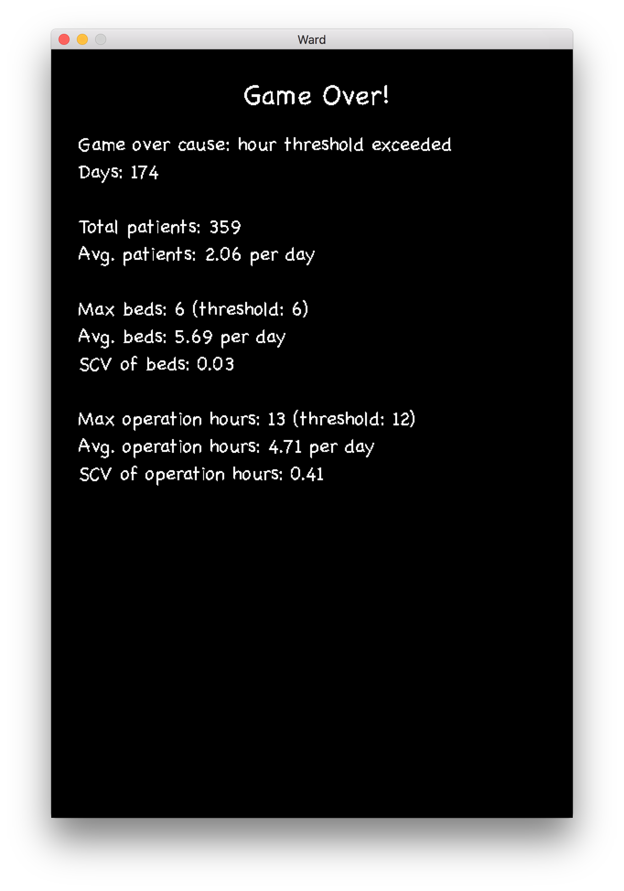

# Ward AI

This is a Tetris-like game with a heuristic-driven AI player. Rather than `Python 3.6`, everything is written is `Python 2.7` due to poor performance of `pygame-c36` on Mac OS.

The original [Tetris game](https://github.com/allenfrostline/Tetris-AI), which has been simplified and implemented with the AI, is based on this [non-AI version](https://gist.github.com/kch42/565419/download).

## Model description

Now we run a hospital with a neural ward of 6 beds. The operation room for neural surgeries opens 12 hours a day. Assume Poisson patient arrival at rate 2 per day. For each patient, the surgery can take at most 4 hours, and the total number of days for him/her to stay at the ward (including the surgery day) must not exceed 5. We want to schedule the patients for the coming 4 weeks in such a way that the bed occupancy is smoothed and the daily surgery hours are as fully used as possible (but should never be exceeded).



In this Tetris game board, each column stands for a bed in the ward and each row for a day, e.g. the bottom left cell stands for the occupancy status of bed 1 on the next day. Each patient is symbolized to an `I`-stone in Tetris games, though with different lengths and two colors. Gray boxes means days in the ward but with no surgery, and yellow boxes with numbers indicate the operation day and surgery hours needed. 

From the model specification, it is clear that we cannot exceed row-sum of 12 and max-height of 28, and our very basic objective is the survive the game as long as possible.

These are the files:

1. `ward.py`: Run this file to play the game
2. `ai.py`: ?
3. `heuristic.py`: ?

## Dependencies

Requires `pygame` (which isn't on pip). You can download [here](https://bitbucket.org/pygame/pygame/downloads). Apart from this, requires `copy`, `threading`, `random`, `collections` and `numpy`.

## Usage

How to install and open the game:

```bash
git clone https://github.com/allenfrostline/Tetris-AI
cd Ward-AI-master
python2.7 ward.py
```

How to play the game:

|KEY|COMMAND|
|---:|:---|
|Down|Drop stone faster|
|Left / Right|Move stone|
|Up|Rotate stone clockwise|
|Escape|Quit this round of game|
|P|Toggle the instant mode for AI|
|Q|Exit the whole game|
|Return|Manual instant drop|
|Space|Replay the game|

## Contributing

1. Fork it!
2. Create your feature branch: `git checkout -b my-new-feature`
3. Commit your changes: `git commit -am 'Add some feature'`
4. Push to the branch: `git push origin my-new-feature`
5. Submit a pull request :-)

## History

By far I really can't find much about previous work on similar models. So I'd say it is novel.

## License

[MIT License](./LICENSE).
